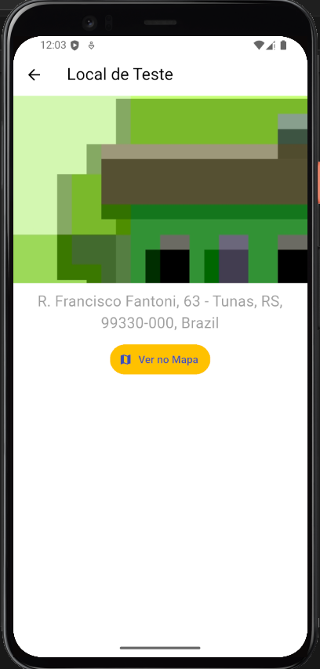

# Great Places
Aplicativo para salvar localizações e imagens. Registre suas localizações preferidas e adicione uma imagem para se lembrar dela.

## Funcionalidades
- Salvar lugar: salve sua localização atual (ou de sua escolha) no mapa, adicione uma imagem para registrar o local.
- Visualizar lugar: visualize em detalhes o local salvo, acessando a imagem, endereço e localização no mapa armazenados.
- Banco de dados local: os dados são armazenados em um banco de dados no dispositivo, via SQLite.
- Google Maps: aplicativo busca os dados diretamente do Google Maps, permitindo navegar pelo mapa da Google para selecionar uma localização, ou acessar sua localização atual.
- Câmera: o aplicativo abre a câmera do dispositivo para registar a foto do lugar.


## Instalação

Siga as etapas abaixo para configurar e executar o projeto localmente:

### Pré-requisitos
Certifique-se de que você tenha o seguinte instalado:
- [Flutter SDK](https://docs.flutter.dev/get-started/install) (versão compatível com o projeto)
- [Android Studio](https://developer.android.com/studio) ou outro editor de sua preferência (opcional, mas recomendado)
- Emulador ou dispositivo físico conectado

### Passo 1: Clone o repositório
No terminal, execute:
```bash
git clone https://github.com/oJaciel/Great-Places-App
cd Great-Places-App
```

### Passo 2: Instale as dependências
Execute o comando:
```bash
flutter pub get
```

### Passo 3: Execute o projeto
Inicie o aplicativo com o comando:
```bash
flutter run
```

Certifique-se de que um dispositivo emulador ou físico esteja conectado para que o app seja executado.
## Capturas de Tela

Abaixo estão algumas capturas de tela da aplicação:

### Tela inicial (lista de lugares)


### Tela do formulário


### Tela do mapa


### Tela de detalhes do lugar

